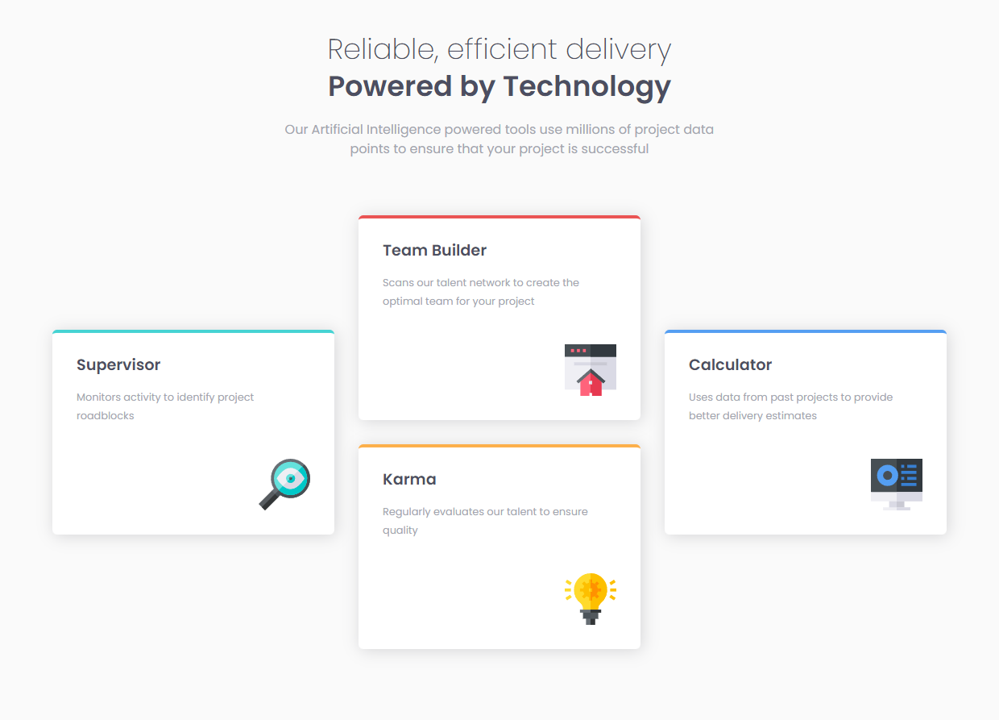

# Frontend Mentor - Four card feature section solution

This is a solution to the [Four card feature section challenge on Frontend Mentor](https://www.frontendmentor.io/challenges/four-card-feature-section-weK1eFYK). Frontend Mentor challenges help you improve your coding skills by building realistic projects.

## Table of contents

- [Overview](#overview)
  - [The challenge](#the-challenge)
  - [Screenshot](#screenshot)
  - [Links](#links)
- [My process](#my-process)
  - [Built with](#built-with)
  - [What I learned](#what-i-learned)
- [Author](#author)

## Overview

### The challenge

Users should be able to:

- View the optimal layout for the site depending on their device's screen size

### Screenshot

### Links

- Solution URL: [Repository](https://github.com/gguilhermelopes/front-end-mentor-four-card-feature-section)
- Live Site URL: [Live URL](https://gguilhermelopes.github.io/front-end-mentor-four-card-feature-section/)

## My process

### Built with

- Semantic HTML5 markup
- CSS custom properties
- Flexbox

### What I learned

I've challenged myself to use only CSS Flexbox to build this project. It was fun and very good for practice!

## Author

- Website - [portfolio](https://gguilhermelopes.github.io/)
- Frontend Mentor - [@gguilhermelopes](https://www.frontendmentor.io/profile/gguilhermelopes)
- Twitter - [@gguilhermlopes](https://twitter.com/gguilhermlopes)
